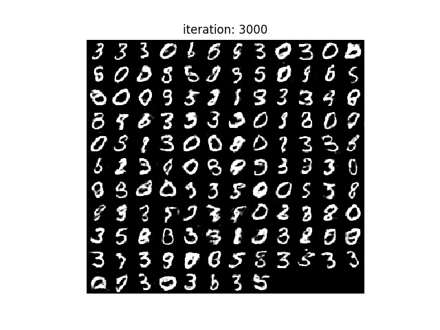
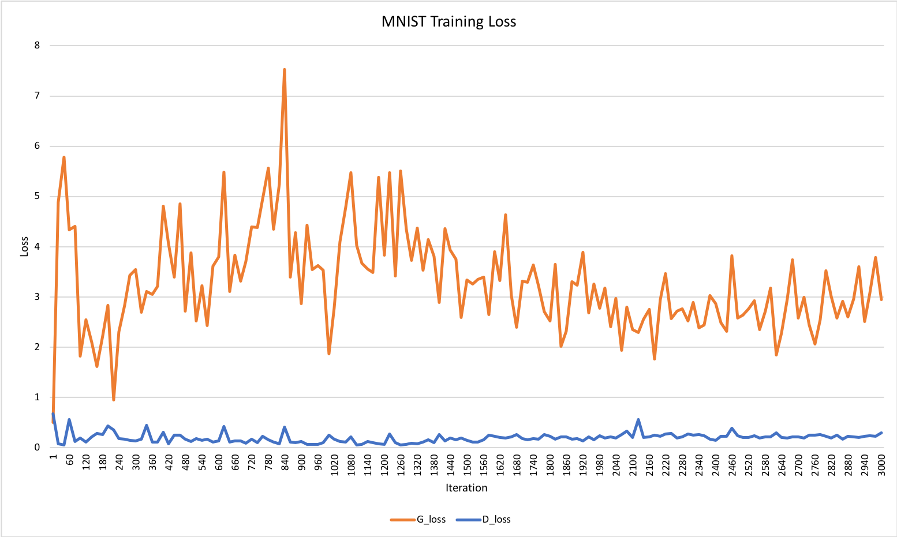
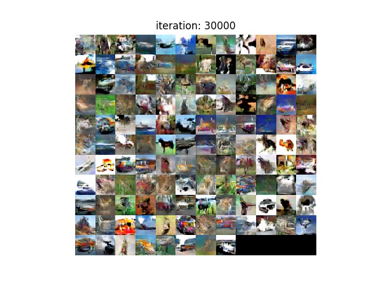
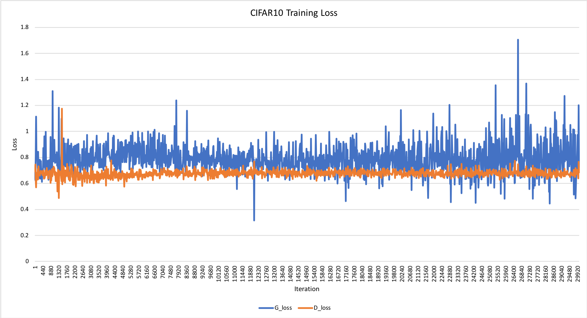
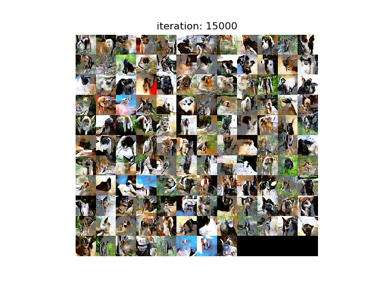
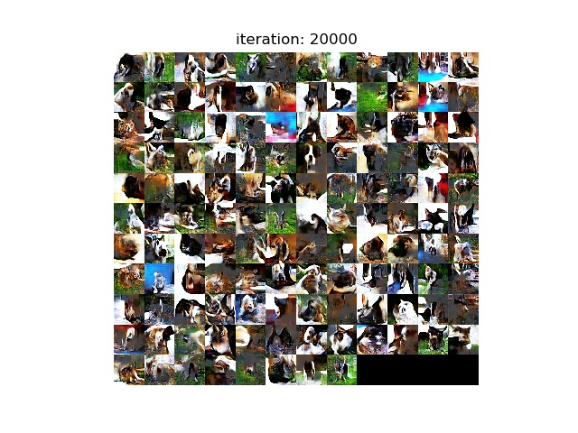

# DCGAN_keras

日本語はこちら >> https://github.com/yoyoyo-yo/DCGAN_keras/blob/master/README_ja.md

This is ***unofficial*** DCGAN implemented with Keras.

I confirmed using MNIST, CIFAR10 and Oxford IIIT pet dataset.
This can train DCGAN with your own dataset.

## Requirements

You can get python packages.

I recommend using Python3, and ***strongly recommend GPU when training (cifar10, original your own dataset with large iteration, minibatch and size ( >= 32x32).***

```bash
When using CPU,
$ pip install -r requirements.txt
When using GPU,
$ pip install -r requirements_gpu.txt
```

## MNIST example

You can use MNIST example.

When training,

```bash
$ python main_mnist.py --train
```

The trained models (Generator and Discreminator) are stored in **models_mnist** directory.(This directory will be made automatically)

You can change above directory and other path in **config_mnist.py**

Generated images in training process are stored in **train_images_mnist** directory (This path is defined in **config_mnist.py**), and the ones in test are stored in **test_images_mnist**

The models are defined in **model_mnist.py**

When testing,

```bash
$ python main_mnist.py --test
```

Generated images are stored in **test_images** directory. (This pass is defined in **config.py**)


|Training process, 28x28|Iteration 3000|
|---|---|
|||

|Loss|
|---|
||

## Cifar10 example

The models are defined by **model_cifar10.py**

Generated images in training process are stored in **train_image_cifar10** (defined in **config_cifar10.py**)

Generated images in test are stored in **test_image_cifar10** (defined in **config_cifar10.py**)

|Training process, 32x32| Iteration 30,000 |
|---|---|
|||

|Loss|
|---|
||

### Usage

```bash
When training,
$ python main_cifar10.py --train
When testing,
$ python main_cifar10.py --test
```

## Your own data training

You collect images and put them to any directory.

***I strongly recommend the number of image is more than 300.***
If data is less (e.g. 100), DCGAN generates same images independent on iteration.

You can change directory path **Train\_dirs** in **config.py**.
You can set one or more absolute passes.
For example, 
```python
Train_dirs = [
    '/mnt/c/Users/demo/Research_nagayosi/Dataset/Moca',
    '/home/usrs/demo/Dataset/Moca',
]
```

### Usage

```bash
When training,
$ python main.py --train
When testing,
$ python main.py --test
```

The models are defined by **model.py**

Generated images in training process are stored in **train_image** (defined in **config.py**)

Generated images in test are stored in **test_image** (defined in **config.py**)

Example of Oxford IIIT Pet dataset [ http://www.robots.ox.ac.uk/~vgg/data/pets/ ]

Training process, 128x128|Iteration 15,000 | Iteration 20,000 |
|---|---|---|
||||
