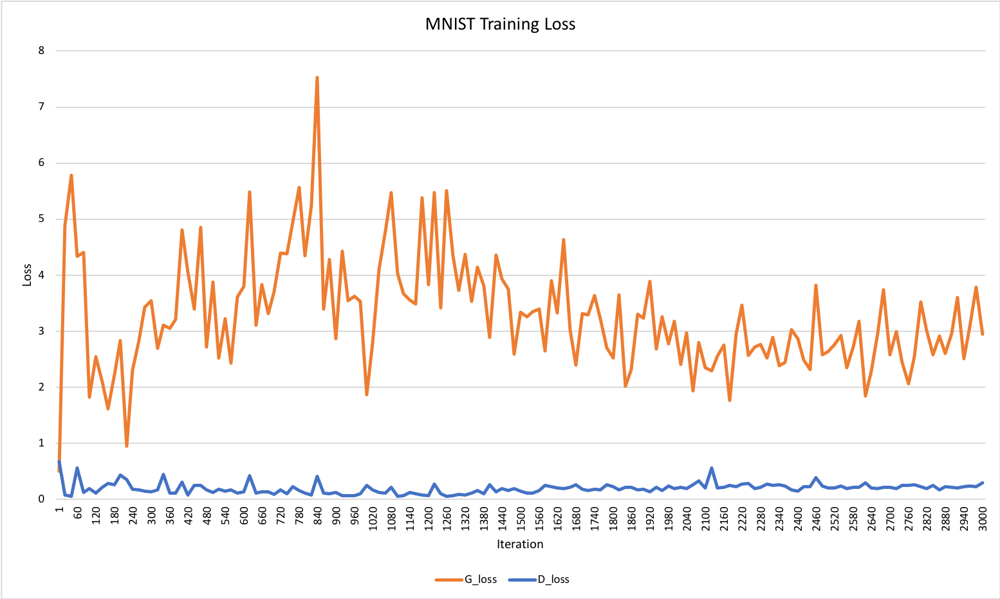
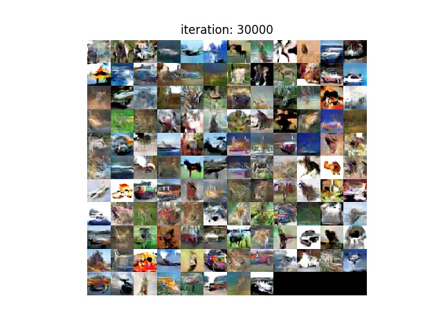
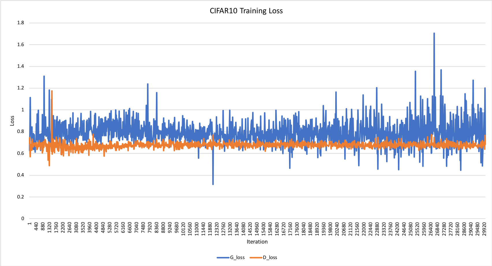

# DCGAN_keras

English is here >> https://github.com/yoyoyo-yo/DCGAN_keras/blob/master/README.md

これはDCGANの非公式なKeras実装です。

MNIST, CIFAR10, Oxfort IIIT Petデータセットで動作を確認済み。
自分でデータセットを用意すれば、任意の画像生成ができます。

## Requirements

以下のコマンドで必要なPythonパッケージをインストールできます。 (Miniconda推奨)
You can get python packages.

Python3をおすすめします。また、***学習時にはGPUの使用を強く推奨します。CIFAR10以上のようなイテレーション回数、バッチサイズ、入力の画像サイズが必要な学習時にはGPUでないと時間がかなりかかります。***

```bash
# When using CPU,
$ pip install -r requirements.txt
# When using GPU,
$ pip install -r requirements_gpu.txt
```

## MNIST example

MNISTでの実行例です。

### 学習は下記コマンドです。

```bash
$ python main_mnist.py --train
```

学習済みモデルは *models_mnist*フォルダに保存されます。（このフォルダは自動的に生成されます。）

*config_mnist.py*のパスを変えれば保存先を変更できます。

学習の各イテレーションでの生成画像は*train_images_mnist*フォルダに保存されます。(これも*config_mnist.py*でパスを変更できます)。テスト時の生成画像は*test_images_mnist*フォルダに保存されます。

### テスト時は

```bash
$ python main_mnist.py --test
```

DCGANのネットワークモデルは*model_mnist.py*で変更できます。

|学習過程, 28x28サイズ|Iteration 3000|
|---|---|
|||

|Loss|
|---|
||

## Cifar10 example

ネットワークモデルは*model_cifar10.py*で変更できます。

### 学習

```bash
$ python main_cifar10.py --train
```

### テスト

```bash
$ python main_cifar10.py --test
```

学習時の各イテレーションでの生成画像は*train_image_cifar10*に保存されます。(*config_cifar10.py*で変更可能)

テスト時の生成画像は*test_image_cifar10*フォルダに保存されます。(*config_cifar10.py*で変更可能)

|Training process, 32x32| Iteration 30,000 |
|---|---|
|||

|Loss|
|---|
||


## 自分のデータセットで学習

まずはどこかに新しくフォルダを作成して、自分で集めた画像を置きます。

画像は300枚以上は集めないと、学習がうまく進みません。(同じ画像しか生成されなくなります。)

次に*config.py*の*train¥_dirs*を画像があるフォルダのパスに変えます。なるべく絶対パスにしてください。
例えば、Mocaというフォルダに画像を入れたとすると、こんな感じです。
フォルダは複数できます。この場合、指定したフォルダの全ての画像を学習に使用します。

```python
Train_dirs = [
    '/mnt/c/Users/demo/Research_nagayosi/Dataset/Moca',
    '/home/usrs/demo/Dataset/Moca',
]
```

### 学習

```bash
$ python main.py --train
```

### テスト

```bash
$ python main.py --test
```

ネットワークモデルは*model.py*で変更可能です。

学習の各過程での生成画像は*train_image*フォルダに保存されます。(*config.py*で変更可能)
テスト時の生成画像は*test_image*フォルダに保存されます。(*config.py*で変更可能)

Oxfort IIIt Petデータセット(犬の画像データセット)での例[ http://www.robots.ox.ac.uk/~vgg/data/pets/ ]

Training process, 128x128|Iteration 15,000 | Iteration 20,000 |
|---|---|---|
||||
